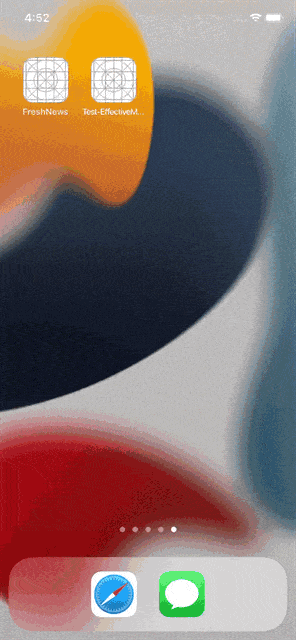

<h1 align="center">Fresh News</h1> 

## Приложение для просмотра новостей
Приложение дает возможность просматривать новости из разных источников по нескольким категориям, а также читать полный текст новости в браузере.

## Технические характеристики приложения

* iOS 13+
* Swift 5
* UIKit full programmatically
* MVVM (Observer)
* Нет внешних зависимостей
* API: https://newsapi.org

## Обзор экранов приложения

<table>
    <thead>
        <tr>
            <th>Основной экран</th>
            <th>Переключение табов</th>
            <th>Переключение страны</th>
        </tr>
    </thead>
    <tbody>
        <tr>
            <td>
                
            </td>
            <td>
                
            </td>
                        <td>
                
            </td>
        </tr>
    </tbody>
</table>
<table>
    <thead>
        <tr>
            <th>Переход в браузер</th>
        </tr>
    </thead>
    <tbody>
        <tr>
            <td>
                
            </td>
        </tr>
    </tbody>
</table>
<table>
    <thead>
        </tr>
    </tbody>
</table>

## Описание работы приложения

    * При запуске приложения появляется индикатор пока загружаются новости и обновляется таблица
    * При переключении табов загружается новый массив новостей
    * Возможность переключить страну - источник новостей
    * Картинки кэшируются
    * При тапе на новость открывается барузер по ссылке на источник
